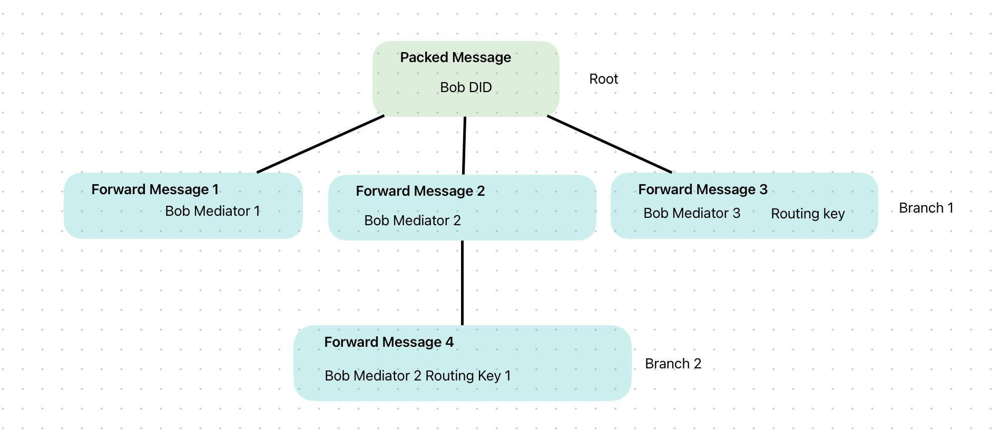

# DIDCommV2 Swift Package

DIDCommV2 is a comprehensive Swift package designed to facilitate the development of applications utilizing the Decentralized Identity Communication (DIDComm) V2 protocol. It offers Swift developers a robust toolkit for building secure, private communication systems based on decentralized identities.

[]() []() []() []() []()

## Table of Contents

  - [Installation](#installation)
    - [Swift Package Manager (SPM)](#swift-package-manager-spm)
  - [Features](#features)
  - [Supported Envelopes](#supported-envelopes)
  - [Signed Envelopes](#signed-envelopes)
  - [Anonymous Envelopes (ECDH-ES+A256KW)](#anonymous-envelopes-ecdh-esa256kw)
  - [Authenticated Envelopes (ECDH-1PU+A256KW)](#authenticated-envelopes-ecdh-1pua256kw)
  - [Other Features](#other-features)
  - [Usage](#usage)
    - [Packing and Unpacking a Plain Message](#packing-and-unpacking-a-plain-message)
    - [Packing and Unpacking a Signed Message](#packing-and-unpacking-a-signed-message)
    - [Packing and Unpacking an Authenticated Encrypted Message](#packing-and-unpacking-an-authenticated-encrypted-message)
    - [Packing and Unpacking an Anonymous Encrypted Message](#packing-and-unpacking-an-anonymous-encrypted-message)
  - [Routing](#routing)
    - [Routing Overview Diagram](#routing-overview-diagram)
    - [Usage Case](#usage-case)
  - [Documentation](#documentation)
  - [References](#references)
  - [Contributing](#contributing)
  - [License](#license)

## Installation

### Swift Package Manager (SPM)

To integrate DIDCommV2 into your Xcode project using SPM, specify it in your Package.swift:

```swift
dependencies: [
    .package(url: "https://github.com/beatt83/didcomm-swift.git", .upToNextMajor(from: "0.1.0"))
]
```

## Features

- **DIDComm V2 Protocol Support:** Implements the DIDComm V2 protocol for secure, private messaging based on decentralized identities.
- **Message Encryption and Decryption:** Offers tools for encrypting and decrypting messages, ensuring privacy and security in communications.
- **Signature and Verification:** Supports message signing for non-repudiation and signature verification for authenticity checks.
- **DID-Based Authentication:** Leverages decentralized identifiers for authentication purposes in messaging applications.
- **Message Packing and Unpacking:** Provides functionalities for packing and unpacking DIDComm messages, including support for plaintext, signed, and encrypted messages.
- **Flexible API:** Designed with a developer-friendly API, making it easy to integrate DIDComm V2 functionalities into Swift applications.
- **Error Handling:** Comprehensive error handling mechanism to capture and manage various error scenarios that may occur during DIDComm message processing.
- **Advanced Routing:** Supports message routing through mediators, enabling complex message delivery scenarios.

## Supported Envelopes

<table>
<tr><th>Envelopes</th></tr>
</td><td valign="top">

| Type                            | Supported        |
|---------------------------------|------------------|
| Plain message                   |:white_check_mark:|
| Signed message                  |:white_check_mark:|
| Encrypted Authenticated message |:white_check_mark:|
| Encrypted Anonymous message     |:white_check_mark:|

</td></tr> </table>

## Signed Envelopes

<table>
<tr><th>Algorithms</th></tr>
</td><td valign="top">

| Type   | Supported        |
|--------|------------------|
| ES256  |:white_check_mark:|
| ES384  |:white_check_mark:|
| ES512  |:white_check_mark:|
| ES256K |:white_check_mark:|

</td></tr> </table>

## Anonymous Envelopes (ECDH-ES+A256KW)

<table>
<tr><th>Encryption Algorithms</th><th>Keys Algorithms</th></tr>
</td><td valign="top">

| Encryption    | Supported        |
|---------------|------------------|
| A256CBC-HS512 |:white_check_mark:|
| A256GCM       |:white_check_mark:|
| XC20P         |:white_check_mark:|

</td><td valign="top">

| Keys      | Supported        |
|-----------|------------------|
| P-256     |:white_check_mark:|
| P-384     |:white_check_mark:|
| P-512     |:white_check_mark:|
| secp256k1 |:white_check_mark:|
| Ed25519   |:white_check_mark:|
| X25519    |:white_check_mark:|

</td></tr> </table>

## Authenticated Envelopes (ECDH-1PU+A256KW)

<table>
<tr><th>Encryption Algorithms</th><th>Keys Algorithms</th></tr>
</td><td valign="top">

| Encryption    | Supported        |
|---------------|------------------|
| A256CBC-HS512 |:white_check_mark:|

</td><td valign="top">

| Keys      | Supported        |
|-----------|------------------|
| P-256     |:white_check_mark:|
| P-384     |:white_check_mark:|
| P-512     |:white_check_mark:|
| secp256k1 |:white_check_mark:|
| Ed25519   |:white_check_mark:|
| X25519    |:white_check_mark:|

</td></tr> </table>

## Other features

<table>
</td><td valign="top">

| Feature                             | Supported        |
|-------------------------------------|------------------|
| Multiple recipients                 |:white_check_mark:|
| From prior JWT                      |:white_check_mark:|
| Anon + Sign                         |:white_check_mark:|
| Anon + Auth + Sign (Protect sender) |:white_check_mark:|
| Routing                             |:white_check_mark:|

</td></tr> </table>

## Usage

The DIDCommV2 Swift Package facilitates creating and processing various types of DIDComm messages, such as plain, signed, and encrypted (both authenticated and anonymous) messages. Here's how to utilize the package for these scenarios:

### Packing and Unpacking a Plain Message

```swift
let didcomm = DIDComm(
    didResolver: // ... DID Resolver implementation,
    secretResolver: // ... Secret Resolver implementation
)

let packed = try await didcomm.packPlainText(params: .init(
    message: // ... Message
))

let unpacked = try await didcomm.unpack(params: .init(packedMessage: packed.packedMessage))

// Utilize `unpacked.message` as needed
```

### Packing and Unpacking a Signed Message

```swift
let didcomm = DIDComm(
    didResolver: // ... DID Resolver implementation,
    secretResolver: // ... Secret Resolver implementation
)

let packed = try await didcomm.packSigned(params: .init(
    message: // ... Message,
    signFrom: "did:example:alice#key-3" // Replace with actual signer DID Key ID
))

let unpack = try await didcomm.unpack(params: .init(packedMessage: packed.packedMessage))

// Validate `unpack.message` as needed
```

### Packing and Unpacking an Authenticated Encrypted Message

```swift
let didcomm = DIDComm(
    didResolver: // ... DID Resolver implementation,
    secretResolver: // ... Secret Resolver implementation
)

let packed = try await didcomm.packEncrypted(params: .init(
    message: // ... Message,
    to: ["did:example:charlie"], // Replace with recipient DID
    from: "did:example:alice", // Replace with sender DID
    encAlgAuth: .a256CBCHS512
))

let didcommUnpack = DIDComm(
    didResolver: // ... recipient DID Resolver implementation,
    secretResolver: // ... recipient Secret Resolver implementation
)

let unpacked = try await didcommUnpack.unpack(params: .init(packedMessage: packed.packedMessage))

// Verify `unpacked.message` content
```

### Packing and Unpacking an Anonymous Encrypted Message

```swift
let didcomm = DIDComm(
    didResolver: // ... DID Resolver implementation,
    secretResolver: // ... Secret Resolver implementation
)

let packed = try await didcomm.packEncrypted(params: .init(
    message: // ... Message,
    to: ["did:example:charlie"], // Replace with recipient DID
    encAlgAnon: .a256GCM // Assuming A256GCM is supported for anonymous encryption
))

let didcommUnpack = DIDComm(
    didResolver: // ... recipient DID Resolver implementation,
    secretResolver: // ... recipient Secret Resolver implementation
)

let unpacked = try await didcommUnpack.unpack(params: .init(packedMessage: packed.packedMessage))

// Validate `unpacked.message` content
```

## Routing

In DIDComm, messages can be delivered to their final destination through a series of mediators. This process, known as routing, involves wrapping the original message in a series of forward messages for each mediator in the path.

The DIDCommV2 Swift SDK simplifies the handling of routing with the RoutingResult structure. When you pack a message for encryption or signing, the SDK can process and return a RoutingResult that contains the necessary forward messages along with the mediators' information.

Each ForwardMessageResult within the RoutingResult holds:

- finalRecipient: The DID of the final recipient.
- routedBy: An array of mediator DIDs that will forward the message.
- forwardMessage: The encrypted message that should be sent to the next mediator.

The SDK ensures that only necessary forward messages are generated and retrieved, avoiding redundant routing steps.

### Routing Overview Diagram

The diagram below illustrates the DIDComm message routing process. It demonstrates how a message for Bob DID is securely forwarded through a series of mediators before reaching the final recipient. Each mediator receives a forward message containing the next mediator's DID or the final recipient's DID, ensuring that the message is reliably transmitted along the specified path.



Forward Message 1 is sent to Bob Mediator 1, which in turn forwards Forward Message 2 to Bob Mediator 2. From there, two branches occur: Forward Message 3 is sent directly to Bob Mediator 3 with a specific routing key, while Forward Message 4 is re-routed through Bob Mediator 2 using a different routing key. This example showcases the flexibility of DIDComm's routing mechanism to support complex message delivery scenarios.

### Usage Case

The following is an example of how you can pack a message that needs to be routed through mediators and then send the forward messages to the appropriate mediators:

```swift
/ Initialize the DIDComm instance with your resolver implementations
let didcomm = DIDComm(
    didResolver: // ... Your DID Resolver implementation,
    secretResolver: // ... Your Secret Resolver implementation
)

// Pack an encrypted message with routing
let packed = try await didcomm.packEncrypted(params: .init(
    message: // ... Your Message object,
    to: ["did:example:bob"], // Bob's DID
    from: "did:example:alice", // Alice's DID (optional)
    encAlgAuth: .a256CBCHS512 // Authenticated encryption algorithm
))

// If there's routing involved, process the forward messages
if let routingResults = packed.routingResult {
    for forwardMessageResult in routingResults.forwardMessages {
        // Here you would send `forwardMessageResult.forwardMessage.packedMessage`
        // to the mediator `forwardMessageResult.routedBy`
        // The actual sending mechanism would depend on your transport layer
    }
}
```

## Documentation

You can access [here](https://beatt83.github.io/didcomm-swift/documentation/didcommswift/) to the documentation.

## References

- [DIDComm Messaging Specification](https://identity.foundation/didcomm-messaging/spec/)
- [DIDComm V2 Protocol Guide](https://didcomm.org/book/v2/)

## Contributing

We highly appreciate community contributions. To contribute, please fork the repository, push your changes, and open a pull request.

## License

This project is licensed under the Apache 2.0 License.
